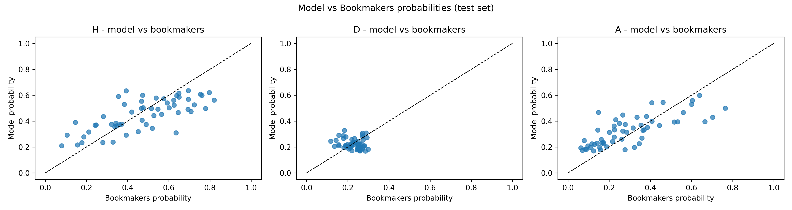
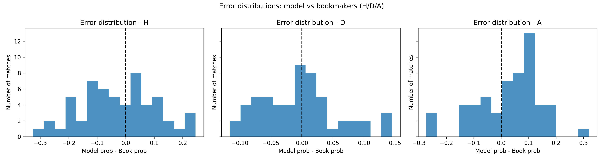
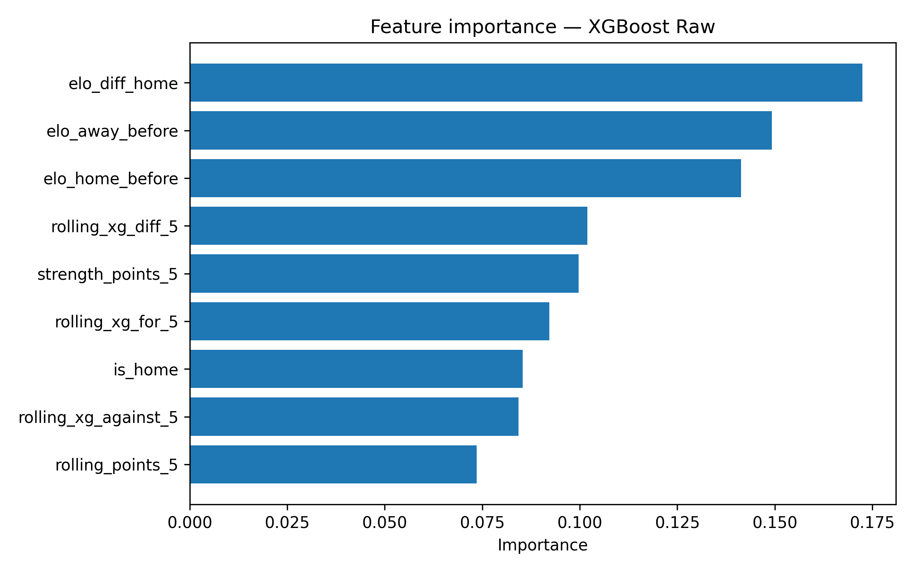

<!DOCTYPE html>
<html lang="en">
<head>
    <meta charset="utf-8">
    <meta http-equiv="X-UA-Compatible" content="IE=edge">
    <meta name="viewport" content="width=device-width, initial-scale=1">
    <title>Your Project Title Here | Advanced Programming 2025</title>
    <meta name="description" content="Course materials and resources for Advanced Programming at UNIL">
    <link rel="stylesheet" href="/course-materials/assets/css/style.css">
    <link rel="canonical" href="https://ap-unil-2025.github.io/course-materials/assets/templates/project_report_template_md.txt">
    
    <!-- Favicons -->
    <link rel="icon" type="image/svg+xml" href="/course-materials/favicon.svg">
    <link rel="icon" type="image/svg+xml" sizes="32x32" href="/course-materials/favicon-32x32.svg">
    <link rel="apple-touch-icon" href="/course-materials/apple-touch-icon.svg">
    <link rel="mask-icon" href="/course-materials/favicon.svg" color="#003aff">
    <meta name="theme-color" content="#003aff">
    
    <!-- Citation Metadata -->
    <meta name="citation_title" content="Your Project Title Here">
    <meta name="citation_author" content="Scheidegger, Simon">
    <meta name="citation_author" content="Smirnova, Anna">
    <meta name="citation_publication_date" content="2025">
    <meta name="citation_journal_title" content="HEC Lausanne Course Materials">
    <meta name="citation_public_url" content="https://ap-unil-2025.github.io/course-materials/assets/templates/project_report_template_md.txt">
    <meta name="citation_pdf_url" content="https://ap-unil-2025.github.io/course-materials/assets/course-materials.pdf">
    
    <!-- Dublin Core Metadata -->
    <meta name="DC.title" content="Your Project Title Here">
    <meta name="DC.creator" content="Simon Scheidegger">
    <meta name="DC.creator" content="Anna Smirnova">
    <meta name="DC.subject" content="Data Science">
    <meta name="DC.subject" content="Python Programming">
    <meta name="DC.subject" content="Machine Learning">
    <meta name="DC.subject" content="Statistical Learning">
    <meta name="DC.description" content="Advanced course introducing Python programming, statistical learning, and high-performance computing for Master's students in Economics and Finance">
    <meta name="DC.publisher" content="HEC Lausanne, University of Lausanne">
    <meta name="DC.date" content="2025-12-06">
    <meta name="DC.type" content="Course Materials">
    <meta name="DC.format" content="text/html">
    <meta name="DC.identifier" content="https://ap-unil-2025.github.io/course-materials/assets/templates/project_report_template_md.txt">
    <meta name="DC.language" content="en">
    <meta name="DC.rights" content="Creative Commons Attribution-ShareAlike 4.0 International License">
    
    <!-- Schema.org structured data for Google Scholar -->
    <script type="application/ld+json">
    {
      "@context": "https://schema.org",
      "@type": "Course",
      "name": "Data Science and Advanced Programming 2025",
      "description": "Advanced course introducing Python programming, statistical learning, and high-performance computing",
      "provider": {
        "@type": "Organization",
        "name": "HEC Lausanne, University of Lausanne",
        "sameAs": "https://www.unil.ch/hec/"
      },
      "instructor": [
        {
          "@type": "Person",
          "name": "Simon Scheidegger",
          "url": "https://sites.google.com/site/simonscheidegger/"
        },
        {
          "@type": "Person",
          "name": "Anna Smirnova"
        }
      ],
      "courseCode": "DSAP2025",
      "hasCourseInstance": {
        "@type": "CourseInstance",
        "courseMode": "https://schema.org/OnlineOnly",
        "startDate": "2025-09-15",
        "endDate": "2025-12-15",
        "location": {
          "@type": "Place",
          "name": "Internef 263",
          "address": {
            "@type": "PostalAddress",
            "addressLocality": "Lausanne",
            "addressCountry": "CH"
          }
        }
      },
      "license": "https://creativecommons.org/licenses/by-sa/4.0/"
    }
    </script>
    
    <!-- Begin Jekyll SEO tag v2.8.0 -->
<title>Your Project Title Here | Advanced Programming 2025</title>
<meta name="generator" content="Jekyll v4.3.4" />
<meta property="og:title" content="Your Project Title Here" />
<meta name="author" content="Your Name (your.email@unil.ch)" />
<meta property="og:locale" content="en_US" />
<meta name="description" content="Course materials and resources for Advanced Programming at UNIL" />
<meta property="og:description" content="Course materials and resources for Advanced Programming at UNIL" />
<link rel="canonical" href="https://ap-unil-2025.github.io/course-materials/assets/templates/project_report_template_md.txt" />
<meta property="og:url" content="https://ap-unil-2025.github.io/course-materials/assets/templates/project_report_template_md.txt" />
<meta property="og:site_name" content="Advanced Programming 2025" />
<meta property="og:type" content="article" />
<meta property="article:published_time" content="2025-12-01T00:00:00+00:00" />
<meta name="twitter:card" content="summary" />
<meta property="twitter:title" content="Your Project Title Here" />
<script type="application/ld+json">
{"@context":"https://schema.org","@type":"BlogPosting","author":{"@type":"Person","name":"Your Name (your.email@unil.ch)"},"dateModified":"2025-12-01T00:00:00+00:00","datePublished":"2025-12-01T00:00:00+00:00","description":"Course materials and resources for Advanced Programming at UNIL","headline":"Your Project Title Here","mainEntityOfPage":{"@type":"WebPage","@id":"https://ap-unil-2025.github.io/course-materials/assets/templates/project_report_template_md.txt"},"url":"https://ap-unil-2025.github.io/course-materials/assets/templates/project_report_template_md.txt"}</script>
<!-- End Jekyll SEO tag -->

</head>
<body>
    <header class="site-header">
        <div class="wrapper">
            <nav class="site-nav" role="navigation" aria-label="Main navigation">
    <div class="site-branding">
        <a class="site-title" href="/course-materials/" aria-label="Homepage">
            
            <span class="site-title-text">DSAP</span>
        </a>
        <a href="https://nuvolos.cloud" target="_blank" rel="noopener noreferrer" class="powered-by-header" aria-label="Powered by Nuvolos">
            <span class="powered-text">Powered by</span>
            
        </a>
    </div>
    
    <button class="nav-toggle" aria-label="Toggle navigation menu" aria-expanded="false">
        <span class="hamburger"></span>
        <span class="hamburger"></span>
        <span class="hamburger"></span>
    </button>
    
    <div class="nav-links" id="nav-links">
        <a href="/course-materials/" >Home</a>
        <a href="/course-materials/syllabus" >Syllabus</a>
        <a href="/course-materials/weekly-materials" >Weekly Materials</a>
        <a href="/course-materials/assignments" >Assignments</a>
        <a href="/course-materials/exercises" >Exercises</a>
        <a href="/course-materials/projects" >Projects</a>
        <a href="/course-materials/help-support" >Help & Support</a>
        <a href="/course-materials/citation" >Cite</a>
        
        
    </div>
</nav>

<script>
document.addEventListener('DOMContentLoaded', function() {
    const navToggle = document.querySelector('.nav-toggle');
    const navLinks = document.querySelector('.nav-links');
    
    if (navToggle && navLinks) {
        navToggle.addEventListener('click', function() {
            const isExpanded = navToggle.getAttribute('aria-expanded') === 'true';
            navToggle.setAttribute('aria-expanded', !isExpanded);
            navLinks.classList.toggle('active');
            document.body.classList.toggle('nav-open');
        });
        
        // Close menu when clicking outside
        document.addEventListener('click', function(event) {
            if (!navToggle.contains(event.target) && !navLinks.contains(event.target)) {
                navToggle.setAttribute('aria-expanded', 'false');
                navLinks.classList.remove('active');
                document.body.classList.remove('nav-open');
            }
        });
        
        // Close menu on escape key
        document.addEventListener('keydown', function(event) {
            if (event.key === 'Escape') {
                navToggle.setAttribute('aria-expanded', 'false');
                navLinks.classList.remove('active');
                document.body.classList.remove('nav-open');
            }
        });
    }
});
</script>

<style>
/* Make navigation more compact */
.site-nav {
    padding: 0.5rem 0;
}

.nav-links {
    gap: 0.75rem;
    font-size: 0.9rem;
}

.nav-links a {
    padding: 0.25rem 0.4rem;
}

.powered-by-header {
    gap: 0.3rem;
}

.powered-text {
    font-size: 0.75rem;
}

.header-nuvolos-logo {
    height: 20px;
}

.nav-toggle {
    display: none;
    background: none;
    border: none;
    cursor: pointer;
    padding: 0.5rem;
    flex-direction: column;
    gap: 0.25rem;
    z-index: 1001;
}

.hamburger {
    width: 24px;
    height: 2px;
    background-color: var(--text-primary);
    transition: all 0.3s ease;
    transform-origin: center;
}

.nav-toggle[aria-expanded="true"] .hamburger:nth-child(1) {
    transform: rotate(45deg) translate(6px, 6px);
}

.nav-toggle[aria-expanded="true"] .hamburger:nth-child(2) {
    opacity: 0;
}

.nav-toggle[aria-expanded="true"] .hamburger:nth-child(3) {
    transform: rotate(-45deg) translate(6px, -6px);
}

.nav-links a.active {
    color: var(--primary-color);
    font-weight: 600;
    background-color: rgba(59, 130, 246, 0.05);
}

/* Hide the underline pseudo-element completely */
.nav-links a::after {
    display: none !important;
}

.external-links {
    margin-left: 2rem;
    padding-left: 2rem;
    border-left: 1px solid var(--border-color);
}

.external-icon {
    font-size: 0.8em;
    opacity: 0.7;
    margin-left: 0.25rem;
}

@media (max-width: 768px) {
    .site-nav {
        position: relative;
    }
    
    .nav-toggle {
        display: flex;
    }
    
    .nav-links {
        position: absolute;
        top: 100%;
        left: 0;
        right: 0;
        background-color: var(--background-color);
        border: 1px solid var(--border-color);
        border-top: none;
        border-radius: 0 0 0.5rem 0.5rem;
        box-shadow: 0 4px 12px rgba(0, 0, 0, 0.1);
        flex-direction: column;
        gap: 0;
        padding: 1rem 0;
        transform: translateY(-10px);
        opacity: 0;
        visibility: hidden;
        transition: all 0.3s ease;
        z-index: 1000;
    }
    
    .nav-links.active {
        transform: translateY(0);
        opacity: 1;
        visibility: visible;
    }
    
    .nav-links a {
        padding: 0.75rem 1.5rem;
        display: block;
        color: var(--text-primary);
        border-bottom: 1px solid var(--border-color);
    }
    
    .nav-links a:last-child {
        border-bottom: none;
    }
    
    .nav-links a:hover {
        background-color: var(--surface-color);
    }
    
    .nav-links a::after {
        display: none;
    }
    
    .external-links {
        margin-left: 0;
        padding-left: 0;
        border-left: none;
        border-top: 1px solid var(--border-color);
        padding-top: 1rem;
        margin-top: 1rem;
    }
    
    body.nav-open {
        overflow: hidden;
    }
}
</style>
        </div>
    </header>

    <main class="page-content page-transition">
        <div class="wrapper page-wrapper">
            
            
            <article class="page">
    <header class="page-header">
        <h1 class="page-title">Your Project Title Here</h1>
        
        <p class="page-subtitle">Advanced Programming 2025 - Final Project Report</p>
        
    </header>

    <div class="page-content">
        # Abstract

This project aims to predict football match outcomes by estimating the probabilities of each outcome possible (Home win, Draw, Away win) and comparing them to the implied probabilities of the bookmakers. These implied probabilities are obtained by averaging the odds from 3 selected bookmakers (Pinnacle, Bet365 and William Hill) coming from Football-data.co.uk and then removing the bookmakers’ margin. After collecting, cleaning, and merging the datasets, I construct several engineered features (e.g. rolling_xg_for_5, elo_home, etc.) using football metrics from FBref.com. Once all the datasets are ready, I train 3 different machine learning models (Linear Regression, Random Forest and XGBoost) using an 80/20 train-test split. After training, the models are calibrated using Platt scaling and Isotonic regression. Based on the lowest log-loss value (0,907707), the best-performing model is the raw XGBoost model. RMSE and MAE are used to evaluate the model performance for each outcome possible. To better understand the discrepancies between my model’s probabilities and those of the average bookmaker, I analyze factors such as home bias and differences between “Big Six” clubs and the rest of the league. Finally, calibration plots, heatmaps, and scatterplots are produced to provide clear visual insights, ensuring that the results remain easy to interpret.


**Keywords:** data science, Python, machine learning, football-data, prediction-model, data-visualization

\newpage

# Table of Contents

1. [Introduction](#introduction)
2. [Literature Review](#literature-review)
3. [Methodology](#methodology)
4. [Results](#results)
5. [Discussion](#discussion)
6. [Conclusion](#conclusion)
7. [References](#references)
8. [Appendices](#appendices)

\newpage

# 1. Introduction
The football of the 21st century has become a place where data is king. Almost everything that happens on a football pitch can be tracked. Most clubs now have entire team dedicated to data analysis, both for player-related data and team-level performance metrics. But they are not the only ones that massively use these data. In fact, bookmakers also rely heavily on them, in addition to real-world information to give probabilities to each of the outcomes possible (home win, draw, away win) as well as many special bets (over/under 3.5 goals etc.). Once the bookmakers add their margin, the odds are created. As a huge football fan and former bettor, I’m always fascinated by how the odds for big team can be so high and so “small” for smaller teams and vice versa.

The focus in this project is the following: to what extent can football performance metrics (such as expected goal (xG), recent strength etc.) be used to predict match outcomes probabilities using machine learning models and how these model-implied probabilities differ from bookmakers’ odds? The analysis relies on datasets collected from Football-Data.co.uk and advanced football metrics from FBref.com.

The first goal of the project is to build a strong predictive model for football outcomes by comparing different machine learning algorithms such as Linear regression, Random Forest and XGBoost. The second goal is to analyze how, where and why differences arise between the model’s predictions and the implied probabilities of the average bookmaker.

The structure of the report is as follows. Section 2 presents the relevant literature. Section 3 describes the methodology: how the datasets are cleaned and merged, the feature engineering procedures, the models used, as well as the calibration and model evaluation process. Section 4 reports the results of the different models. Section 5 discusses the implications of these findings and potential biases such as home advantage or differences between “Big Six” clubs and others. Section 6 summarize the findings and provides suggestions for future improvements.

# 2. Literature Review
The football prediction world was dominated by researchers, long ago, who tried to predict the outcomes of matches by predicting how many goals each team would score, under the assumption that goals follow a Poisson distribution. Maher (1982) proposed modelling home and away goals as independent Poisson processes. People were mostly trying to predict the probabilities of a score and then deduce the resulting outcome. Dixon and Coles (1997) adjusted the probability of low-scoring matches with a correction factor (rho) to reflect the dependence between the two teams, and they weighted each match exponentially so that recent matches count more than older ones. 21st century research switched towards the use of more informative performance metrics. The most used one nowadays is expected goals (xG).

Rathke (2017) has shown that xG is a more accurate provider of the real performance than traditional statistics such as number of shots or possession, while Mead et al. (2023) demonstrate that models based on the xG improves significantly the prediction of the results. Hvattum & Arntzen (2010) have adapted the Elo rating coming from chess-world to football and have shown that it’s a precious tool for predicting the real level of a team as the model is also based on the strength/weakness of the opponent. The idea of using moving average (a.k.a. rolling metrics) is largely inspired by the empirical approach presented by Rathke (2017) and Tax & Joustra (2015). Tax & Joustra (2015) have proven that machine learning model base on trees (Random Forest) perform better than linear models when predicting results in the Dutch Eredivisie. Baboota & Kaur (2019) also reached the same conclusion when applying XGBoost to the English Premier League. However, the probabilities of the machine learning models are often not reliable. As pointed out by Niculescu-Mizil and Caruana (2005), it is necessary to apply Platt scaling and isotonic regression for reliable probabilities. This becomes even more important when comparing the model against bookmaker odds. Additional complexities in the betting markets are pointed out by researchers. Bookmakers exploit bettor biases argues Levitt (2004). One of the strongest biases according to him is that bettors tend to over bet the underdogs which result in weaker odds for underdogs in comparison to their true probability. These different bias allows bookmakers to set odds that deviate from true probability and of course still maintain high profits. Because the odds set by any bookmaker include a margin, there are several authors who have suggested methods to extract unbiased implied probabilities, for example, adjustment methods by Clarke (2017). Overall, the literature supports the integration of advanced football metrics, machine learning, and probability calibration, with clear recognition of structural biases in betting markets. This project therefore extends these foundations through the comparison of calibrated model probabilities with margin-adjusted bookmaker probabilities, with added analysis of how, where, and why divergences arise.


# 3. Methodology
## 3.1 Data Description
This project is based on two main sources of data concerning the 2022-2023 English premier league season. The first source is Football-data.co.uk. It allows us to collect the odds of each game for more than ten different bookmakers and the important information to identify a game (date, time, names of both teams). There are 380 lines and 106 columns in this dataset. The second was obtained from a publicly available dataset extracted from FBref.com and published on GitHub by the user Dataquestio. This dataset allows us to collect the important metrics for the project (xG for, xG against etc.). However further work was required to standardize team names, remove inconsistencies, and ensure mergeability with bookmaker data. There are 4788 lines and 26 columns in this dataset.
After the cleaning, merging and engineering of features, the final dataset (features_match_long_elo_22_23.csv) used for the analysis consist of 760 lines (38 games in a season * 20 teams) and 33 columns. 
The dataset is fully tabular, combining both numerical and categorical variables (home team, away team, etc.) with each row representing a football match from a team perspective (2 rows for one game) and all variables describing pre-match information. 
Nine features were created. The most important one being elo_diff_for_team. The Elo rating is a pre-match-strength indicators based on past results. Rolling metrics such as "rolling_xg_for_5", "rolling_xg_against_5" were also a big part.
They were no missing value that could affect the proper functioning of the analysis.


## 3.2 Approach
Three models were used to predict the implied probability of the outcomes and therefore the results: 1. Linear regression: This is a classification algorithm that is good for predicting probability. It estimates the probability of a binary or multi-class outcome, as in our case, Win/Draw/Loss. Quick to train and easy to understand, it’s often a very good baseline model. 2. Random Forest: It’s a strong nonlinear model that handles well diverse football features (xG, rolling metrics, Elo). It’s very efficient to capture nonlinear and complex interactions. For example, recent form may have an impact only if the team plays away. However, we must be careful with the overfitting issues 3. XGBoost: This model builds trees sequentially, each new tree tries to correct the residual mistakes of all the preceding trees. It’s one of the most powerful techniques for structured data. In general, it’s the most accurate model when dealing with probabilistic predictions. However, XGBoost requires many hyperparameters that are not always easy to tune or to understand.
Before running the algorithms, a preparation phase was needed. First, the two datasets were cleaned by selecting only the necessary columns for the 2022-2023 season and by normalizing team names and date format across all datasets because ad several naming variations existed for a team, sometime even within the same dataset (e.g. from “Man City” to “Manchester City”). New variables were created such as “prob_book_home”, which is the average of the implied probability from bookmakers once the margin is removed. Once the columns names were standardized everywhere, an inner merge could be done using the keys: “date”, “home_team” and “away_team”. After that, feature engineering could begin. Rolling metrics were the biggest part of the work, they consist of averaging the last 5-games values of one statistic to capture the recent form of a team. Finally, an Elo rating was created and Elo-based features were added to the final dataset. 
All 3 models follow the same architecture: First, load and prepare the datasets (NaN had to be removed, NaN were present in the rolling features) then sort and split the datasets using a chronological train-test ratio. This ratio of 0.8 permits the model to train on the first 80% of the dataset and after train on the last 20% (the sorting phase is important to avoid information leakage). After encoding the target (H/D/A) and scaling the features (only needed for the baseline model) the training of the model can be achieved. It’s important to try different values of hyperparameter to reduce overfitting. Once the model is trained, the results are evaluated using 3 tools: accurate, log-loss and Mean brier score. A calibration curve is generated and saved in the result folder to assess how close the predicted probabilities are to the frequencies. A calibration experiment is also realized to compare raw probabilities with Platt scaling and Isotonic regression. 
The comparison to the bookmakers is made once the 3 models are running correctly and the best one is selected (based on the smallest log-loss). The comparison is done using RMSE and MAE and several scatter plot, heatmap and barplot are drawn trying to explain why and how the model’s probabilities differ from the bookmakers. 

 
## 3.3 Implementation
The project is fully implemented in Python, using a set of widely used scientific and machine-learning libraries. The main packages are: Numpy, Pandas, Matplotlib, Seaborn, scikit-learn, XGBoost, pathlib. They are useful for data manipulation, visualization, modeling, evaluation metrics etc. 
The codebase is organized into a set of modular scripts stored in the /src folder, each responsible for one specific step of the pipeline. This structure brings clarity and reproducibility and makes the project easier to maintain. The main file is main.py, which orchestrates the full workflow by calling the functions defined in each script. The execution order is the following: 1. Data preparation: run_clean_matches(), run_cleaning_bookmakers_data(), run_merge_data() and run_feature_engineering() 2. Baseline and elo-related components: run_logistic_baseline(), run_elo_rating_wide() and run_add_elo_features() 3. Model pipelines:run_baseline_with_elo(), run_random_forest_pipeline(), run_xgboost_pipeline() 4. Calibration experiments: run_full_calibration_pipeline() 5.  Comparison with bookmakers: run_comparison() The key code components are the first three modules who clean and merge the two dataset, because without that nothing can be achieved. Last two are also important as they provide the answers to the research question. 

Example code snippet:
```python
# Add rolling xG features over the last N games per team (no leakage).
def add_rolling_xg_features(df: pd.DataFrame, window: int = 5) -> pd.DataFrame:
    df = df.copy()          # Work on a copy to avoid modifying the original DataFrame

    df["rolling_xg_for_5"] = np.nan         # Initialize new columns with NaN
    df["rolling_xg_against_5"] = np.nan     
    df["rolling_xg_diff_5"] = np.nan        

    for team in df["team"].unique():            # Process each team separately
        team_mask = df["team"] == team

        # xG for (offensive form)
        team_xg_for = df.loc[team_mask, "xg_for"]    # Select only the xG for values corresponding to the current team
        df.loc[team_mask, "rolling_xg_for_5"] = (
            team_xg_for.shift(1).rolling(window).mean())   
        # .shift(1) to shift the series by one so the current game doesn't use its own xG value (prevents data leakage).
        # .rolling(window) create a rolling window over the last N past matches (default: 5 matches).
        # .mean() compute the average xG over the rolling window.

        # xG against (defensive form)
        team_xg_against = df.loc[team_mask, "xg_against"]
        df.loc[team_mask, "rolling_xg_against_5"] = (
            team_xg_against.shift(1).rolling(window).mean())

        # xG diff
        team_xg_diff = df.loc[team_mask, "xg_diff"]
        df.loc[team_mask, "rolling_xg_diff_5"] = (
            team_xg_diff.shift(1).rolling(window).mean())

    return df           # Return the updated DataFrame with rolling features added
```

# 4. Results
## 4.1 Experimental Setup
Hardware: Experiments were executed on a standard consumer laptop (HP), powered with an Intel Core i7 processor. No dedicated GPU was used; the models were trained on a standard CPU. Software: Python 3.12.6, Pandas 2.3.3, seaborn 0.13.2, xgboost 3.1.2, matplotlib 3.10.7, scikit-learn 1.7.2 This setup is lightweight and fully reproducible on any standard machine. 
Machine learning models include several adjustable settings, called hyperparameters. These settings influence how the model learns and how complex it can become. They act like “instruction rules” that help for different things such as to avoid the overfitting issue and to improve the stability. These values were selected after trying multiple combinations “by hand” and look which one provides the smallest log-loss and smallest overfit. For logistic regression, the main element is the optimization method (“lbfgs”), which ensures that the model will converge correctly even with many features. For Random Forest, the most important hyperparameters control the structure of the trees. n_estimators=400, max_depth=6, min_samples_split=5, min_samples_leaf=4, max_features="sqrt", random_state=42, n_jobs=-1, bootstrap=True, max_samples=0.8,
For XGBoost, some additional regularization hyperparameters were necessary because the model is more flexible. objective="multi:softprob", num_class=3, n_estimators=200, learning_rate=0.05, max_depth=3, min_child_weight=6, gamma=1, subsample=0.7, colsample_bytree=0.7, reg_lambda=3.0, reg_alpha=1, random_state=42, n_jobs=-1, eval_metric="mlogloss",  
Since the models used in this project are tree-based (Random Forest, XGBoost) and not neural networks, training does not rely on epochs. Instead, the number of boosting rounds (n_estimators) determines the size of the model. Cross-validation was not used because the data is temporal. A chronological split (80% train, 20% test) ensures that the model only learns from past matches and does not leak information from the future.

## 4.2 Performance Evaluation

| Model + calibration     | Accuracy | Log-loss | Mean-Brier | 
|-------------------------|----------|----------|------------|
| Logistic + Isotonic     | 0.60714  | 1.01539  | 0.19339    |
| Logistic + Platt        | 0.61607  | 0.93570  | 0.18418    | 
| Logistic + raw          | 0.60714  | 0.94864  | 0.18629    |
| RandomForest + Isotonic | 0.61607  | 1.83101  | 0.18019    | 
| RandomForest + Platt    | 0.61607  | 0.91112  | 0.17709    |
| RandomForest + raw      | 0.62500  | 0.91111  | 0.17707    |
| XGBoost + Isotonic      | 0.60714  | 1.55443  | 0.17983    |
| XGBoost + Platt         | 0.63393  | 0.90839  | 0.17551    |
| XGBoost + raw           | 0.61607  | 0.90774  | 0.17550    |
*Table 1: Model performance comparison*

| Outcome | RMSE (model vs book)| MAE (model vs book) |
|---------|---------------------|---------------------|
| H       | 0.20713             | 0.16992             |
| D       | 0.16699             | 0.13507             |
| A       | 0.17963             | 0.14796             |
*Table 2: Comparison between the best model (XGBoost raw) and bookmakers' implied probabilities*

## 4.3 Visualizations
# 4.3.1 Model vs bookmakers
  
*Figure 1: Scatter plots comparing the model’s predicted probabilities with bookmaker implied probabilities for Home, Draw and Away outcomes.*

The diagonal line represents perfect agreement. Most points lie reasonably close to this line, indicating that the model globally follows the structure of bookmaker pricing, while visible deviations highlight where the model systematically assigns higher or lower probabilities than the market.

# 4.3.2 Error distribution
  
*Figure 2: Distribution of prediction errors (model probability − bookmaker probability) for each outcome.*  

A distribution centered around zero indicates little systematic bias. Home and Draw errors are slightly shifted below zero, suggesting a small underestimation by the model, while Away errors are shifted above zero, indicating a small overestimation. These distributions help quantify how the model diverges from bookmaker on average.

# 4.3.3 Feature importance

*Figure 3: Feature importance for the XGBoost model (raw)

This plot highlights which inputs the model relies on most when predicting match outcomes. ELO ratings dominate the decision process, indicating that team strength is the primary driver of predictions, while recent form (rolling xG and points) plays a secondary but meaningful role.

# 5. Discussion
Overall, the global pipeline performed well. The features engineered, particularly Elo ratings and the rolling xG metrics, significantly contributed to the results as the feature-importance plot demonstrated. The merging phase was quite demanding at first. As well as the rolling features construction where careful attention was required to avoid data leakage. Hyperparameter tuning for Random Forest and XGBoost was challenging but necessary to obtain well fitted model. Before running the models, it was expected that the overall performance of bookmakers would be better than that of the machine-learning models because of their richer information. These results confirm this partially: the probabilities of the bookmakers are still smoother and overall better-calibrated. However, the model performed better than expected regarding raw accuracy and could produce competitive probability estimates, especially concerning away wins. The relatively low difference in RMSE and MAE between XGBoost and the bookmakers suggests that, even with only historical performance metrics, a data-driven approach can approximate bookmaker-level predictions. However, as the datasets are only based on one season this does not give enough information to the models to learn stable and long-term patterns. Moreover, the data is statistical, meaning the models do not have access to the pre-match crucial information (e.g. injuries, starting lineups etc) and context information (e.g. last game of the season is a must-win for certain teams). This missing information naturally creates a gap between the probabilities of the model and the one of the bookmakers. Surprisingly, the model systematically underestimates teams like Chelsea and Manchester City at home. For Chelsea, this is explained by the fact that they were inconstant during that season (finishing 12th), making it difficult for rolling features to understand the real level of the team. As for Manchester City, this is caused by the fact that Bookmakers constantly tend to “boost” them by assigning them high probabilities. They know how dominant the team is historically and how strong they become in the final stretch of the season, where the model only sees the data and does not know that they win the last 2 seasons.

# 6. Conclusion

## 6.1 Summary
The aim of this project was to investigate to what extent machine learning models can provide a probability as close as that of bookmakers’ implied probability, and how well football performance data alone can forecast match outcome probability? The outcome of this project is encouraging with 61% accuracy, average root means square error of 0.1846, and average mean absolute error of 0.1510 for the best model. We can conclude that football performance stats are helpful to get probabilities close to those of bookmakers. Yet the model, as expected, has revelated to be inaccurate for some games, this is caused by the lack of information. Finally, this study is a undeniable good start for comprehending the predictive potential and limits of data-driven modeling in football.

## 6.2 Future Work
Several additions could improve the results obtained. Most obvious one is to feed the models with more data. By adding more season of English Premier League, the models could learn more pattern and build a better historical understanding of each team. Adding informational features such key players missing would likely have an impact as well. Extending the project to other championships could be interesting to see if some championships are “easier” to predict than others. Finally, implementing a betting back testing system would allow to us  evaluate whether the models would have won or lose money over time. This would be for information purposes only because as experts often say: “The odds are never wrong; it’s the football that contradicts them”.

# References

1. Author, A. (2024). *Title of Article*. Journal Name, 10(2), 123-145.

2. Smith, B. & Jones, C. (2023). *Book Title*. Publisher.

3. Dataset Source. (2024). Dataset Name. Available at: https://example.com

4. Library Documentation. (2024). *Library Name Documentation*. https://docs.example.com

# Appendices

## Appendix A: Additional Results

Include supplementary figures or tables that support but aren't essential to the main narrative.

## Appendix B: Code Repository

**GitHub Repository:** https://github.com/MattisD3/Data-Science-in-Football-Comparing-Model-Predictions-with-Betting-Market-Odds

### Repository Structure

```
DATA-SCIENCE-IN-FOOTBALL-COMPARING-MODEL-PREDICTIONS-WITH-BETTING-MARKET-ODDS/
├── README.md                     # Overview + installation + usage instructions
├── requirements.txt              
├── environment.yml               # Conda environment file for reproducibility
├── project_report.md             # Final project report (Markdown version)
├── PROPOSAL                      # Initial project proposal
├── main.py                             # Main script to run the full pipeline end-to-end
├── data/                               # Input datasets
│   ├── raw/                            # Raw EPL 22/23 data (Football-Data, FBref)
|       ├── matches.csv                 
│       └── data_bookmakers_22_23.csv
│   └── processed/                      # Cleaned and merged datasets used for modeling
│
├── notebooks/                          # Jupyter notebooks for exploration and prototyping
|
├── src/                                # Main source code for the pipeline
│   ├── A_clean_matches.py                      # Cleaning and preprocessing match data
│   ├── B_clean_bookmakers_data.py              # Cleaning bookmakers' odds
│   ├── C_merge_data.py                         # Merging all data sources together
│   ├── D_feature_engineering.py                # Feature creation (xG rolling stats, etc.)
│   ├── E_model_baseline_logistic.py            # Logistic regression baseline model
|   ├── F_elo_rating.py                         # Creating Elo-based features
|   ├── G_add_elo_to_long_features.py           # Merging Elo-based features to the feature dataset
|   ├── H_model_baseline_logistic_with_elo.py   # Logistic regression including Elo features
│   ├── I_random_forest.py                      # Random Forest model
│   ├── J_xgboost.py                            # XGBoost model
│   ├── K_calibration_experiments.py            # Calibration (Platt, Isotonic) + curves
│   └── L_model_vs_bookmakers.py                # Model vs bookmakers probability comparison
│
├── results/                            # Outputs generated by the pipeline (Plots, metrics, calibration curves)
├── tests/                       
├── docs/                         
└── .gitignore                          # Files and folders excluded from version control

```

### Installation Instructions

```bash
git clone https://github.com/MattisD3/Data-Science-in-Football-Comparing-Model-Predictions-with-Betting-Market-Odds
cd Data-Science-in-Football-Comparing-Model-Predictions-with-Betting-Market-Odds
conda env create -f environment.yml
conda activate football-outcome-prediction
```

### Reproducing Results

```bash
python main.py 
```

---

*Note: This report should be exactly 10 pages when rendered. Use the page count in your PDF viewer to verify.*

---

## Conversion to PDF

To convert this Markdown file to PDF, use pandoc:

```bash
pandoc project_report.md -o project_report.pdf --pdf-engine=xelatex
```

Or with additional options:

```bash
pandoc project_report.md \
  -o project_report.pdf \
  --pdf-engine=xelatex \
  --highlight-style=pygments \
  --toc \
  --number-sections
```
    </div>
</article>
        </div>
    </main>

    <footer class="site-footer">
        <div class="wrapper">
            <p class="license">
                <a rel="license" href="http://creativecommons.org/licenses/by-sa/4.0/">
                    
                </a>
                This work is licensed under a <a rel="license" href="http://creativecommons.org/licenses/by-sa/4.0/">Creative Commons Attribution-ShareAlike 4.0 International License</a>.
            </p>
            <p class="citation">
                <strong>Cite as:</strong> Scheidegger, S., & Smirnova, A. (2025). <em>Data Science and Advanced Programming 2025</em>. HEC Lausanne, University of Lausanne. 
                <a href="/course-materials/citation">View citation formats →</a>
            </p>
            <p class="credits">Made with 💙 by Anna Smirnova, Prof. Simon Scheidegger, and Claude 🤖</p>
            <p class="powered-by">
                <a href="https://nuvolos.cloud" target="_blank" style="display: inline-flex; align-items: center; gap: 0.5rem; color: inherit; text-decoration: none;">
                    Powered by
                    
                </a>
            </p>
        </div>
    </footer>

    <!-- Smooth Page Transitions -->
    <style>
    /* No CSS transitions - just AJAX navigation */
    
    /* Smooth scrolling for same-page links */
    html {
        scroll-behavior: smooth;
    }
    
    /* Removed underline animation - clean hover effect only */
    </style>

    <script>
    // Smooth SPA-style navigation
    document.addEventListener('DOMContentLoaded', function() {
        const pageContent = document.querySelector('.page-wrapper');
        const navLinks = document.querySelectorAll('.nav-links a');
        
        // Handle navigation clicks with AJAX
        navLinks.forEach(link => {
            // Skip external links
            if (link.hostname !== window.location.hostname) {
                return;
            }
            
            link.addEventListener('click', function(e) {
                e.preventDefault();
                
                const url = this.href;
                const currentPath = window.location.pathname;
                
                // Skip if same page
                if (url === window.location.href) {
                    return;
                }
                
                // Fetch new page content
                fetch(url)
                    .then(response => response.text())
                    .then(html => {
                        // Parse the new page
                        const parser = new DOMParser();
                        const newDoc = parser.parseFromString(html, 'text/html');
                        const newContent = newDoc.querySelector('.page-wrapper');
                        const newTitle = newDoc.querySelector('title');
                        
                        // Update content instantly
                        if (newContent) {
                            pageContent.innerHTML = newContent.innerHTML;
                            
                            // Re-execute any script tags in the new content
                            const scripts = pageContent.querySelectorAll('script');
                            scripts.forEach(script => {
                                const newScript = document.createElement('script');
                                if (script.src) {
                                    newScript.src = script.src;
                                } else {
                                    newScript.textContent = script.textContent;
                                }
                                script.parentNode.replaceChild(newScript, script);
                            });
                        }
                        if (newTitle) {
                            document.title = newTitle.textContent;
                        }
                        
                        // Update URL without reload
                        history.pushState({}, '', url);
                        
                        // Update active navigation
                        updateActiveNav(url);
                        
                        // Scroll to top
                        window.scrollTo({ top: 0, behavior: 'smooth' });
                    })
                    .catch(error => {
                        console.log('AJAX failed, falling back to normal navigation');
                        window.location.href = url;
                    });
            });
        });
        
        // Handle browser back/forward
        window.addEventListener('popstate', function() {
            window.location.reload();
        });
        
        // Update active navigation state
        function updateActiveNav(currentUrl) {
            navLinks.forEach(link => {
                link.classList.remove('active');
                if (link.href === currentUrl || 
                    (currentUrl.includes('/week/') && link.href.includes('/weekly-materials'))) {
                    link.classList.add('active');
                }
            });
        }
        
        // Initial active state
        updateActiveNav(window.location.href);
    });
    </script>
</body>
</html>